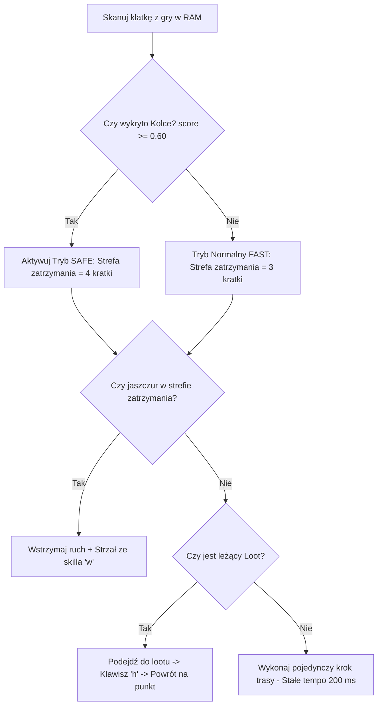

# Context & Status: Rucoy Online Standalone Archer Bot

Pełna dokumentacja stanu projektu, architektury, parametrów operacyjnych i komend do natychmiastowej kontynuacji pracy od 0.

---

## 1. Architektura i Pakiety Projektu

Projekt opiera się na samodzielnym skrypcie w języku Python ([rucoy_bot.py](file:///c:/VS/rucoy/rucoy_bot.py)), który zarządza całą automatyzacją Rucoy Online na emulatorze Nox Player (rozdzielczość okna 1600x900).

### Wykorzystywane biblioteki:
* `win32gui`, `win32process`, `win32api` – bezpośrednie sterowanie oknem Nox Player bez przenoszenia kursorów użytkownika.
* `mss` – szybkie zrzuty ekranu pamięci podręcznej RAM.
* `opencv-python (cv2)` – detekcja wzorców, czytanie pętli zdrowia/many, rozpoznawanie kolców i lootu (`cv2.matchTemplate`).
* `numpy` – numeryczne przeliczanie macierzy pikseli i weryfikacja ruchu `get_screen_diff`.

---

## 2. Gałęzie Git (Branching Strategy)

* **`master`:** Stabilna wersja bazowa z tradycyjnym sekwencyjnym podchodzeniem.
* **`FAST` (AKTYWNA GAŁĄŹ):** Wersja wysoce zoptymalizowana:
  - Stałe tempo 200 ms (`step_delay = 0.20`) na każdy krok trasy.
  - Płynny marsz non-stop bez zatrzymywania się.
  - Strzelanie ze skilla `'w'` asynchronicznie w biegu (`[MOB W BIEGU]`) do mobów oddalonych o 4–6 kratek.
  - Zatrzymanie tylko dla bliskich mobów ($\le 3$ kratki) lub podczas aktywnego **Trybu SAFE** przy kolcach ($\le 4$ kratki).

---

## 3. Struktura Katalogów i Szablonów Graficznych

```
c:/VS/rucoy/
├── rucoy_bot.py                # Główny skrypt bota (FSM, Vision, Controller, CLI)
├── CONTEXT.md                  # Pełny dokument kontekstowy projektu
├── .gitignore                  # Ignorowane pliki tymczasowe i pamięć podręczna Pythona
├── routes/
│   └── l4_route.json           # Ścieżka patrolowa L4 (464 precyzyjne waypointy)
└── templates/
    ├── lizard_variants/        # 9 wariantów graficznych jaszczurów (lizard_1.png - lizard_9.png)
    ├── item_variants/          # 5 wariantów leżącego lootu (item_1.png - item_5.png)
    └── spike_variants/         # 3 warianty pułapek z kolcami (spike_1.png - spike_3.png)
```

---

## 4. Parametry Konfiguracji i Progi Działania

Wszystkie parametry sterujące znajdują się na początku pliku [rucoy_bot.py](file:///c:/VS/rucoy/rucoy_bot.py#L20-L55):

| Parametr | Wartość | Opis |
| :--- | :--- | :--- |
| **Interpreter Python** | `C:/Users/inetk/AppData/Local/Microsoft/WindowsApps/python3.12.exe` | Pełna ścieżka do Pythona 3.12 w systemie Windows. |
| **Emulator** | Nox Player (1600x900) | Tytuł okna: `'Nox'`. Okno automatycznie pozycjonowane przez `WindowManager`. |
| `MATCH_THRESHOLD` | `0.60` (60%) | Próg czułości OpenCV dla jaszczurów. |
| `ITEM_MATCH_THRESHOLD` | `0.65` (65%) | Próg czułości wykrywania lootu. |
| `SPIKE_MATCH_THRESHOLD` | `0.60` (60%) | Próg czułości wykrywania pułapek z kolcami. |
| `WAYPOINT_STEP_DELAY` | `0.20` s (200 ms) | Stałe tempo wykonywania pojedynczych kroków trasowania w trybie FAST. |
| `HP_POTION_THRESHOLD` | `0.75` (75%) | Poniżej 3/4 HP używana jest mikstura leczenia (Klawisz: `'3'`). Pasek odczytywany na $X=400, Y=18..38$. |
| `MANA_POTION_THRESHOLD` | `0.50` (50%) | Poniżej 1/2 Mana używana jest mikstura many (Klawisz: `'1'`). Pasek odczytywany na $X=400, Y=45..54$. |
| `POTION_COOLDOWN` | `1.0` s | Czas oczekiwania na uleczenie postaci przed kolejnym sprawdzaniem paska. |
| `KEY_SPECIAL_ATTACK` | `'w'` | Klawisz ataku specjalnego Łucznika. |
| `KEY_LOOT` | `'h'` | Klawisz zbierania przedmiotów w emulatorze Nox. |

---

## 5. Zbudowane Tryby i Narzędzia CLI

Wszystkie komendy uruchamiane są z poziomu konsoli PowerShell za pomocą pełnej ścieżki Pythona:

### 1. Uruchomienie bota na trasie L4:
```bash
& C:/Users/inetk/AppData/Local/Microsoft/WindowsApps/python3.12.exe rucoy_bot.py --route l4_route.json
```

### 2. Nagrywanie nowej trasy (Direct Nox API Hook):
```bash
& C:/Users/inetk/AppData/Local/Microsoft/WindowsApps/python3.12.exe rucoy_bot.py --record-route l4_route.json
```
*Kliknięcia są rejestrowane bezpośrednio w Noxie. Zakończenie: naciśnij ENTER lub `q` w konsoli.*

### 3. Kalibracja i dodawanie szablonów jaszczurów:
```bash
& C:/Users/inetk/AppData/Local/Microsoft/WindowsApps/python3.12.exe rucoy_bot.py --calibrate-lizard
```

### 4. Kalibracja i dodawanie szablonów podłogowego lootu:
```bash
& C:/Users/inetk/AppData/Local/Microsoft/WindowsApps/python3.12.exe rucoy_bot.py --calibrate-item
```

### 5. Kalibracja i dodawanie szablonów kolców pułapek:
```bash
& C:/Users/inetk/AppData/Local/Microsoft/WindowsApps/python3.12.exe rucoy_bot.py --calibrate-spike
```

---

## 6. Szczegóły Logiki Walki i Trybu SAFE w Branchu `FAST`



---

## 7. Historia Zmian i Osiągnięć (Dziennik Prac)

1. **Optymalizacja wydajności I/O (`DEBUG_MODE = False`):** Usunięto zapisywanie plików obrazów z pamięci dyskowej na każdej klatce. Czas analizy skrócił się z $300-500\text{ms}$ do $<10\text{ms}$.
2. **Rozwiązanie problemu tekstu na paskach HP/Mana:** Przesunięto badanie pikseli z zakłóconego tekstem obszaru środkowego na czysty punkt $X=400$, uniezależniając bota od napisu `4,279/4,285`.
3. **Optymalizacja OpenCV Matching:** Skrócono `SCALE_RANGE` do 3 skal (`np.linspace(0.92, 1.08, 3)`), uzyskując 2.3-krotne przyspieszenie wykrywania graficznego.
4. **Naprawa auto-inkrementacji nazw szablonów:** Wyliczanie `max_idx + 1` chroni pliki w folderach `lizard_variants`, `item_variants` i `spike_variants` przed nadpisywaniem.
5. **Wdrożenie dynamicznego Trybu SAFE:** Automatyczne rozpoznawanie kolców, płynne zwiększanie strefy wstrzymywania kroku do 4 kratek i samoczynny powrót do pełnego tempa 200 ms po wyjściu ze strefy zagrożenia.
6. **Integracja z Repozytorium Git:** Stworzono repozytorium, dodano plik `.gitignore` i utworzono wydajną gałąź roboczą `FAST`.
