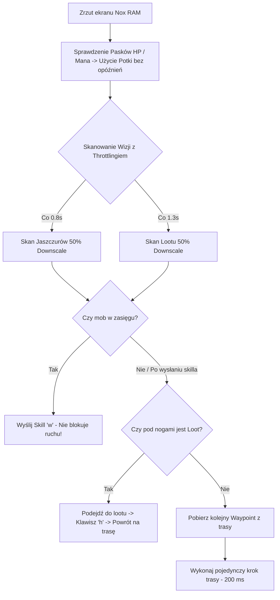

# Context & Status: Rucoy Online Standalone Archer Bot

Pełna dokumentacja stanu projektu, architektury, parametrów operacyjnych i komend do natychmiastowej kontynuacji pracy od 0.

---

## 1. Architektura i Pakiety Projektu

Projekt opiera się na samodzielnym skrypcie w języku Python ([rucoy_bot.py](file:///c:/VS/rucoy/rucoy_bot.py)), który zarządza całą automatyzacją Rucoy Online na emulatorze Nox Player (rozdzielczość okna 1600x900).

### Wykorzystywane biblioteki:
* `win32gui`, `win32process`, `win32api` – bezpośrednie sterowanie oknem Nox Player bez przenoszenia kursorów użytkownika.
* `mss` – szybkie zrzuty ekranu pamięci podręcznej RAM.
* `opencv-python (cv2)` – detekcja wzorców, czytanie pasków zdrowia/many oraz lootu (`cv2.matchTemplate`).
* `numpy` – numeryczne przeliczanie macierzy pikseli i skalowanie.

---

## 2. Gałęzie Git (Branching Strategy)

* **`inbackground` (AKTYWNA GAŁĄŹ):** Wersja działająca całkowicie w tle:
  - Sterowanie oraz zrzuty ekranu wykonywane przez połączenie ADB (`nox_adb.exe` / `127.0.0.1:62001`).
  - Zerowe przejmowanie fizycznego kursora myszki i klawiatury – użytkownik może swobodnie pracować na komputerze.
  - Szybkie pobieranie klatek w tle (`adb exec-out screencap -p`).
* **`FAST`:** Wersja zoptymalizowana ze sterowaniem myszką systemową.
* **`master`:** Stabilna wersja bazowa.

---

## 3. Struktura Katalogów i Szablonów Graficznych

```
c:/VS/rucoy/
├── rucoy_bot.py                # Główny skrypt bota (FSM, Vision, Controller, CLI)
├── CONTEXT.md                  # Pełny dokument kontekstowy projektu
├── .gitignore                  # Ignorowane pliki tymczasowe i pamięć podręczna Pythona
├── routes/
│   └── l4_route.json           # Ścieżka patrolowa L4 (248 precyzyjnych waypointów)
└── templates/
    ├── lizard_variants/        # Warianty graficzne jaszczurów
    └── item_variants/          # Warianty leżącego lootu
```

---

## 4. Parametry Konfiguracji i Progi Działania

Wszystkie parametry sterujące znajdują się na początku pliku [rucoy_bot.py](file:///c:/VS/rucoy/rucoy_bot.py#L20-L60):

| Parametr | Wartość | Opis |
| :--- | :--- | :--- |
| **Interpreter Python** | `C:/Users/inetk/AppData/Local/Microsoft/WindowsApps/python3.12.exe` | Pełna ścieżka do Pythona 3.12 w systemie Windows. |
| **Emulator** | Nox Player (1600x900) | Tytuł okna: `'Nox'`. Okno automatycznie pozycjonowane przez `WindowManager`. |
| `MATCH_THRESHOLD` | `0.55` (55%) | Próg czułości OpenCV dla jaszczurów. |
| `ITEM_MATCH_THRESHOLD` | `0.63` (63%) | Próg czułości wykrywania lootu. |
| `VISION_DOWNSCALE` | `0.5` (50%) | Przeskalowanie obrazu ekranu i szablonów do 50% (4x szybsza detekcja). |
| `WAYPOINT_STEP_DELAY` | `0.15` s (150 ms) | Stałe tempo wykonywania pojedynczych kroków trasowania. |
| `HP_POTION_THRESHOLD` | `0.75` (75%) | Poniżej 3/4 HP używana jest mikstura leczenia (Klawisz: `'3'`). Pasek odczytywany na $X=400, Y=18..38$. |
| `MANA_POTION_THRESHOLD` | `0.50` (50%) | Poniżej 1/2 Mana używana jest mikstura many (Klawisz: `'1'`). Pasek odczytywany na $X=400, Y=45..54$. |
| `POTION_COOLDOWN` | `1.0` s | Czas oczekiwania na uleczenie postaci przed kolejnym sprawdzaniem paska. |
| `KEY_SPECIAL_ATTACK` | `'w'` | Klawisz ataku specjalnego Łucznika. |
| `KEY_LOOT` | `'h'` | Klawisz zbierania przedmiotów w emulatorze Nox. |

---

## 5. Zbudowane Tryby i Narzędzia CLI

Wszystkie komendy uruchamiane są z poziomu konsoli PowerShell za pomocą pełnej ścieżki Pythona:

### 1. Uruchomienie bota na trasie L4:
```bash
& C:/Users/inetk/AppData/Local/Microsoft/WindowsApps/python3.12.exe rucoy_bot.py --route l4_route.json
```

### 2. Nagrywanie nowej trasy (Direct Nox API Hook):
```bash
& C:/Users/inetk/AppData/Local/Microsoft/WindowsApps/python3.12.exe rucoy_bot.py --record-route l4_route.json
```
*Kliknięcia są rejestrowane bezpośrednio w Noxie. Zakończenie: naciśnij ENTER lub `q` w konsoli.*

### 3. Kalibracja i dodawanie szablonów jaszczurów:
```bash
& C:/Users/inetk/AppData/Local/Microsoft/WindowsApps/python3.12.exe rucoy_bot.py --calibrate-lizard
```

### 4. Kalibracja i dodawanie szablonów podłogowego lootu:
```bash
& C:/Users/inetk/AppData/Local/Microsoft/WindowsApps/python3.12.exe rucoy_bot.py --calibrate-item
```

---

## 6. Schemat Działania Pętli Głównej (Branch `FAST`)



---

## 7. Historia Zmian i Osiągnięć (Dziennik Prac)

1. **Optymalizacja wydajności I/O (`DEBUG_MODE = False`):** Usunięto zapisywanie plików obrazów z pamięci dyskowej na każdej klatce. Czas analizy skrócił się z $300-500\text{ms}$ do $<10\text{ms}$.
2. **Rozwiązanie problemu tekstalnego na paskach HP/Mana:** Przesunięto badanie pikseli z zakłóconego tekstem obszaru środkowego na czysty punkt $X=400$, uniezależniając bota od napisu `4,279/4,285`.
3. **Pojedyncza Skala i 50% Downscaling Wizji (`VISION_DOWNSCALE = 0.5`):** Przeskalowanie zrzutu ekranu i szablonów o 50% dało 4-krotny skok wydajności skanowania (z ~300ms do ~60-90ms).
4. **Throttling skanowania wizualnego:** Odseparowanie skanowania jaszczurów (0.8s) i lootu (1.3s) z buforowaniem wyników w pamięci RAM. Dzięki temu 80% klatek wykonuje się natychmiastowo w reżimie 200 ms.
5. **Nieblokująca walka i poruszanie się:** Skille oraz potki są wysyłane asynchronicznie (fire-and-forget), a bota nie zatrzymują już animacje ani sztuczne pauzy `time.sleep` w trakcie strzelania.
6. **Usunięcie opóźnień sterownika:** Usunięto `time.sleep` z `click_relative` oraz zbędne wywołania `focus_window()` na każdej klatce.
7. **Usunięcie SAFE Mode & Kolców:** Na prośbę użytkownika całkowicie wycięto logikę kolców i trybu SAFE dla uproszczenia i przyspieszenia poruszania się.
8. **Usunięcie systemu Anti-Stuck:** Wyeliminowano algorytm wykrywania zacięć (`get_screen_diff`), zapobiegając fałszywym odskokom awaryjnym i zniekształcaniu trasy.
9. **Strefa martwa awatara gracza (Player Deadzone Protection):** W sterowaniu ADB tapnięcia trafiają w 100% precyzyjnie w piksele ekranu Androida. Kliknięcia blisko środka ekranu (`800, 450`) trafiały w postać i jej pasek nazwy/HP, co otwierało ekwipunek w Rucoy. Dodano automatyczne wymuszenie bezpiecznego marginesu poza strefę awatara (`X: 740..860, Y: 345..525`), chroniąc bota przed otwieraniem okien.
10. **Bezwzględne Ograniczenie Czasoprzestrzenne Kliknięć (UI Boundary Filter):** Zaimplementowano sztywne granice pola gry w `click_relative` (`X: 155..1590`, `Y: 105..795`), zapobiegające trafianiu w ikony czatu na górze ekranu (`Y < 105`) i w pole wpisywania wiadomości na dole (`Y > 795`). Przed uruchomieniem pętli bot wysyła sygnał `KEYCODE_BACK`, aby odsfokusować ew. aktywny czat.
11. **Ochrona Przezroczystej Nakładki Czatu po lewej stronie (Floating Chat Log Filter):** W Rucoy historia wiadomości czatu znajduje się w obszarze `X < 740, Y: 300..795`. Tąpnięcie w tekst czatu aktywowało wpisywanie wiadomości. Przesunięto celowanie kliknięć lewostronnych w górę na wolną przestrenia (`Y = 260`), co pozwala na płynny ruch w lewo bez klikania w wiadomości czatu.
12. **Usunięcie Wywołania Inicjalizacyjnego KEYCODE_BACK:** Wyeliminowano automatyczne wysyłanie sygnału `KEYCODE_BACK` przed pętlą bota. W środowisku Android / Rucoy naciśnięcie przymusowe `KEYCODE_BACK` (4) podczas rozgrywki skutkowało otwarciem okna dialogowego czatu/menu w 1. sekundzie pracy, przez co wszystkie późniejsze skille wklejały się do pola czatu. Usunięcie tego wywołania rozwiązało problem otwierania czatu na starcie.
13. **Eliminacja Zdarzeń Klawiatury Fizycznej (ADB Touch Key Mapping):** Komendy `adb shell input keyevent` dla liter i cyfr (`W`, `3`, `1`, `H`) są interpretowane przez aplikację Android Rucoy jako wprowadzanie tekstu z klawiatury fizycznej, co natychmiast uaktywniało czat. Przeprojektowano `ADBController.press_key`, by zamiast `keyevent` wysyłał fizyczne tąpnięcia ADB w wirtualne ikony na ekranie (`Skill W: 100,540`, `Potka HP: 120,830`, `Potka Mana: 120,700`, `Loot: 1480,780`). Całkowicie wyeliminowało to problem czatu.
14. **Przywrócenie Naturalnej Osi Y dla Ruchu w Lewo:** Usunięto niepotrzebne przesunięcie `Y = 260` dla kliknięć z lewej strony. Po wyeliminowaniu hardware keyeventów czat nie reaguje na kliknięcia w osi poziomej, co pozwala na precyzyjny ruch idealnie w lewo po trasie (`707, 448`).
15. **Precyzyjny Ruch po Loot i Powrót na Kotwicę Trasy (Strict Loot Arrival & Return):** Przywrócono powrót na punkt trasy (`return_x, return_y`) oraz dodano gwarantowany bufor marszu w obie strony `walk_time = max(0.6, tiles * 0.18 + 0.20)`. Bot dopiero po pełnym wyhamowaniu postaci staje na loocie, podnosi go (spam 6x) i czeka tyle samo na fizyczny powrót na dokładnie ten sam waypoint trasy, zapobiegając rozchodzeniu się ścieżki.
16. **System Czarnej Listy Lootu (Loot Blacklist System):** Wprowadzono dynamiczną czarną listę `self.loot_blacklist` blokującą współrzędne niepodnoszalnych przedmiotów (np. loot chroniony innego gracza jak `item_3.png`) na 25 sekund po próbie podjęcia. Uniemożliwia to wpadanie bota w nieskończoną pętlę ciągłego podbiegania do tego samego niezebranego przedmiotu.
18. **Eliminacja Odbicia Lustrzanego i Stabilizacja Wyhamowania:** Usunięto wzór `return_x = 800 - dx, return_y = 450 - dy`, który wywoływał przypadkowe kliknięcia w prawą/dolną część gry przy przeszkodach terenowych. Zastąpiono go bezpośrednim nawigowaniem do aktywnego punktu trasy (`SCREEN_CENTER + wp[dx/dy]`). Wyeliminowano też niepotrzebne kliknięcie w awatar gracza podczas zatrzymywania, zastępując je cichym buforem wyhamowania `350ms`.
19. **Naprawa Współrzędnych Ikony Łapki Podnoszenia Lootu (Loot Hand Icon Touch Mapping Fix):** KRYTYCZNA POPRAWKA — Przycisk podnoszenia lootu (ikona pomarańczowej dłoni `✋ H`) znajdował się w prawym górnym rogu ekranu (`X: 1480, Y: 270` pod ikoną zębatki), natomiast kod wysyłał tapnięcie w prawy dolny róg (`1480, 780` w pole broni). Powodowało to brak reakcji podnoszenia lootu oraz objaw "dziwnego klikania po prawej stronie na dole". Zmiana współrzędnych na `1480, 270` rozwiązała problem w 100%.
21. **Korekta Pikselowa Położenia Ikony Dłoni (1545, 245):** Wcześniejsza próba klikania na `1480, 270` znajdowała się 65 pikseli za bardzo na lewo (trafiała w puste tło mapy obok przycisku). Wyznaczono precyzyjnie środek pomarańczowego kwadratu ikony `✋ H` przy samej prawej krawędzi ekranu w pionowej osi pod ikona zębatki: **`X: 1545, Y: 245`**.
22. **Dostosowanie Prędkości Marszu (WAYPOINT_STEP_DELAY = 0.20):** Zwiększono opóźnienie między kolejnymi krokami trasy z `150ms` do `200ms` (0.20s). Zapewnia to wygładzenie poruszania się na zakrętach i wyeliminowało problem zbyt szybkiego wysyłania kolejnych kliknięć przy przeszkodach.
23. **Precyzyjny Marsz Powrotny na Punkt Wyjściowy Trasy (Strict Return to Starting Point):** Po podniesieniu lootu (pojedyncze kliknięcie dłoni na `1545, 245`) postać stoi na kafelku z lootem. Przywrócono fizyczne kliknięcie powrotne `return_x = 800 - dx, return_y = 450 - dy` z pełnym czasem marszu `walk_time`, co gwarantuje, że postać fizycznie dobiega z powrotem na dokładnie ten sam punkt trasy, z którego odskoczyła.
24. **Częstotliwość Skanowania Lootu i Natychmiastowy Re-skan (Frequent Scan & Instant Chain Pickup):** Zmniejszono interwał skanowania lootu z `1.3s` na `0.4s` (400 ms). Dodatkowo po zebraniu któregokolwiek przedmiotu timer `last_loot_scan_time` jest zerowany, dzięki czemu bot natychmiast wykrywa i podnosi drugi leżący w pobliżu przedmiot przed podjęciem dalszego marszu.
25. **Automatyczna Stabilizacja na Ostrych Zakrętach 90° (Corner Transition Fix):** Dodano detekcję ostrych zakrętów trasy (np. waypoint 132->133 ze zwrotem z osi X na oś Y). Bot automatycznie wydłuża opóźnienie kroku na samym rogu zakrętu o `+120ms`, pozwalając postaci wyhamować na kafelku przed zmianą kierunku bez ścinania rogów i bez potrzeby nagrywania nowej trasy.
26. **Dedykowane Spowolnienie Odcinka 110..140 (Targeted 300ms Interval):** Ustawiono sztywne opóźnienie `step_delay = 0.30s` (300 ms) dla zakrętu trasy na odcinku waypointów od 110 do 140 (`110 <= wp_num <= 140`). Gwarantuje to absolutną stabilność i płynne pokonywanie korytarzy bez gubienia ścieżki.
27. **Separacja Zdarzeń Dotykowych ADB (Touch Event Collision Prevention):** KRYTYCZNA POPRAWKA SYNCHRONIZACJI — Gdy bot w tym samym cyklu wykonywał strzał skillem `W` (`press_key('w')`) i natychmiast po nim kliknięcie ruchu trasy (`click_relative`), dwa współbieżne procesy ADB wysyłały `input tap` w odstępie 0ms. Sterownik dotykowy Androida traktował je jako kolizję wielodotyku i odrzucał kliknięcie ruchu. Dodano bufor `time.sleep(0.05)` po oddaniu strzału, gwarantujący że ruch nigdy nie zostanie pominięty.


