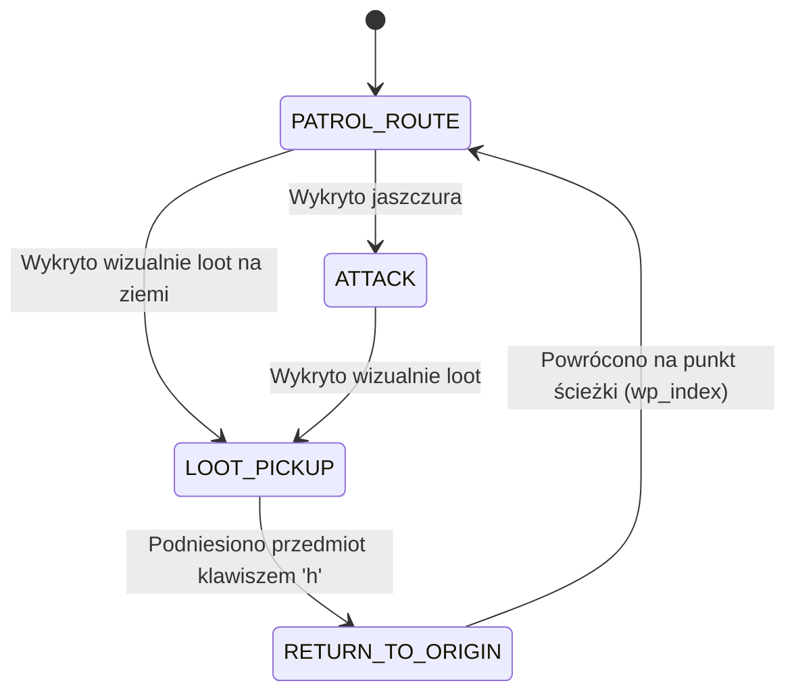

# Rucoy Online Standalone Archer Bot – Dokumentacja Techniczna i Context

Projekt demonstruje automatyzację procesów w grach z wykorzystaniem wizji komputerowej (Computer Vision) oraz manipulacji wejściem systemu Windows. Bot przeznaczony jest dla gry MMO RPG 2D **Rucoy Online**, uruchomionej na emulatorze **Nox Player** w rozdzielczości obszaru roboczego **1600x900**.

---

## 1. Architektura i Struktura Projektu

Całość bota została zintegrowana w **jednym pliku głównym**, co eliminuje złożoność zależności i ułatwia uruchamianie:

* [rucoy_bot.py](file:///c:/VS/rucoy/rucoy_bot.py) – Główny plik wykonywalny zawierający pełną logikę bota:
  * Wyszukiwanie i pozycjonowanie okna Nox Player.
  * Przechwytywanie klatek ekranu (`mss`) i symultaniczną analizę obrazu (`OpenCV`) dla potworów oraz leżącego lootu.
  * Wykrywanie stanu statystyk gracza (HP / MP).
  * Kontrolę myszy i klawiatury (`pydirectinput`) w tym zbieranie przedmiotów klawiszem `'h'`.
  * Skończoną Maszynę Stanów (FSM) z nawigacją po nagranych trasach (Record & Replay), zbieraniem lootu i powrotem na trasę oraz systemem Anti-Stuck.
  * Wbudowane narzędzie do nagrywania tras (`--record-route`) oraz kalibracji szablonów (`--calibrate`, `--calibrate-item`).
* [routes/](file:///c:/VS/rucoy/routes) – Katalog przechowujący zapisane trasy w formacie JSON (np. `l4_route.json`).
* [templates/lizard_variants/](file:///c:/VS/rucoy/templates/lizard_variants) – Katalog przechowujący wzorce graficzne przeciwników (np. `lizard_1.png`).
* [templates/item_variants/](file:///c:/VS/rucoy/templates/item_variants) – Katalog przechowujący wzorce leżących przedmiotów/potek/złota (np. `item_1.png`).
* [debug/](file:///c:/VS/rucoy/debug) – Katalog generowany automatycznie przy włączonym `DEBUG_MODE=True`, zawiera podgląd dopasowania mobków (`last_match.png`) oraz lootu (`last_loot_match.png`).
* [preview_alignment.png](file:///c:/VS/rucoy/preview_alignment.png) – Tymczasowy zrzut ekranu zapisywany podczas kalibracji.

---

## 2. Opis Modułów i Klas w [rucoy_bot.py](file:///c:/VS/rucoy/rucoy_bot.py)

### 2.1. Zarządzanie Oknem (`WindowManager`)
Odpowiada za integrację z API systemu Windows (`ctypes.windll.user32`):
* **Wyszukiwanie okna:** Przegląda widoczne okna systemowe (`EnumWindows`) w poszukiwaniu frazy `"Nox"`.
* **Focus i Przywracanie:** Automatycznie przywraca okno z paska zadań (`ShowWindow(..., SW_RESTORE)`) oraz ustawia jako aktywne (`SetForegroundWindow`).
* **Korekta Wymiarów:** Wylicza grubość ramek i paska tytułowego okna (`GetClientRect` vs `GetWindowRect`), a następnie wymusza dokładną rozdzielczość wewnątrz okna (Client Area) równą **1600x900** za pomocą `SetWindowPos`.

### 2.2. Detekcja i Analiza Obrazu (`GameVision`)
Wykorzystuje biblioteki `mss` (szybkie zrzuty ekranu) oraz `OpenCV` (`cv2`):
* **Maskowanie UI (`_mask_ui`):** Wyczernia stałe elementy interfejsu (menu górne, czat, lewy panel umiejętności, prawy panel ataków), zapobiegając fałszywym detekcjom.
* **Wieloskalowy i Multi-Template Matching (`find_lizard_target` oraz `find_loot_target`):**
  * Przegląda wzorce w [templates/lizard_variants/](file:///c:/VS/rucoy/templates/lizard_variants) oraz w [templates/item_variants/](file:///c:/VS/rucoy/templates/item_variants).
  * Przeskalowuje szablony w zakresie `SCALE_RANGE` (85% – 115%).
  * Wykonuje `cv2.matchTemplate` z normą `TM_CCOEFF_NORMED`.
  * Filtruje dopasowania powyżej progów `MATCH_THRESHOLD` oraz `ITEM_MATCH_THRESHOLD`.
* **Selekcja Najbliższego Celu:** Z pośród znalezionych trafień wylicza dystans euklidesowy do środka ekranu `SCREEN_CENTER` `(800, 450)` – bot kieruje się do najbliższego celu/przedmiotu.
* **Weryfikacja Statystyk (`is_stat_low`):** Analizuje profil pikseli w obszarach `HP_BAR_REGION` oraz `MANA_BAR_REGION`. Sprawdza poziom wypełnienia kolorem BGR i porównuje z progiem procentowym.

### 2.3. Sterowanie Wejściem (`GameController`)
Wysyła komendy do okna Noxa za pomocą `pydirectinput`:
* `click_relative()`: Przelicza koordynaty z wnętrza okna gry na pozycje na ekranie monitora, dodając losowy szum (jitter ±5px).
* `press_key()`: Symuluje wciśnięcie klawiszy (`'w'` - skill, `'h'` - loot, `'1'` - HP, `'3'` - MP).

### 2.4. Maszyna Stanów i System Trasy (Record & Replay)
Bot odtwarza nagraną pętlę kroków (np. dla L4 dungeonu) zapisaną w pliku JSON:



* **Priorytetyzacja Działań w `run_step()`:**
  1. **Leczenie / Mana** (najwyższy priorytet).
  2. **Atak symultaniczny:** Jeśli w polu widzenia jest jaszczur, bot aktywuje skill ataku (`'w'`).
  3. **Ruch po Loot i Powrót:** Jeśli leży przedmiot, bot wylicza dystans `(dx, dy)`, odczekuje czas przejścia (przy prędkości 4 kratki/sekundę), wciska `'h'` 2 razy i natychmiast powraca w miejsce wyjściowe `(800 - dx, 450 - dy)`.
  4. **Podchodzenie do moba:** Jeśli brak lootu, ale jest jaszczur -> podchodzi do jaszczura.
  5. **Nawigacja po Ścieżce (PATROL):** Jeśli brak lootu i brak mobków -> bot pobiera kolejny krok z nagranej trasy `self.waypoints[self.wp_index]`, odczekuje realistyczny czas przejścia i inkrementuje indeks `self.wp_index`.

---

## 3. Nagrywanie i Uruchamianie Tras (`--record-route` / `--route`)

### Nagrywanie Nowej Trasy (np. Dungeon L4)
1. Wpisz w terminalu:
   ```bash
   python rucoy_bot.py --record-route l4_route.json
   ```
2. Otworzy się interaktywne okno podglądu z celownikiem środka postaci.
3. Klikaj myszą kolejne punkty na mapie, po których postać ma chodzić. Na ekranie zobaczysz ponumerowane czerwone punkty i połączenia ścieżki.
4. Gdy wykonasz pełne kółko, naciśnij **ENTER** (lub **q**), aby zapisać trasę w katalogu [routes/](file:///c:/VS/rucoy/routes).

### Uruchamianie Bota z Nagraną Trasą
```bash
python rucoy_bot.py --route l4_route.json
```
*(Jeśli nie podasz argumentu, bot automatycznie spróbuje wczytać domyślny plik `routes/l4_route.json`)*.

---

## 4. Kalibracja Wzorców (`--calibrate` oraz `--calibrate-item`)

1. **Kalibracja Potworów:** `python rucoy_bot.py --calibrate`
2. **Kalibracja Przedmiotów (Lootu):** `python rucoy_bot.py --calibrate-item`

---

## 5. Konfiguracja i Parametryzacja

Wszystkie kluczowe stałe znajdują się na początku pliku [rucoy_bot.py](file:///c:/VS/rucoy/rucoy_bot.py#L15-L50):

| Parametr | Domyślna wartość | Opis |
| :--- | :--- | :--- |
| `MATCH_THRESHOLD` | `0.65` | Próg czułości dopasowania potworów OpenCV. |
| `ITEM_MATCH_THRESHOLD` | `0.65` | Próg czułości wykrywania leżącego lootu. |
| `DETECTION_RANGE_TILES` | `6` kratek | Promień wykrywania jaszczurów we wszystkich kierunkach (lewo, prawo, góra, dół) wokół postaci. |
| `LEASH_MAX_TILES_X` | `6` kratek | Maksymalne skumulowane odchylenie X od kotwicy trasy podczas pogoń/loot (Smycz Bojowa). |
| `LEASH_MAX_TILES_Y` | `4` kratki | Maksymalne skumulowane odchylenie Y od kotwicy trasy podczas pogoń/loot (Smycz Bojowa). |
| `KEY_LOOT` | `'h'` | Klawisz podnoszenia lootu z podłogi w Noxie. |
| `KEY_SPECIAL_ATTACK` | `'w'` | Klawisz ataku specjalnego łucznika. |
| `HP_POTION_THRESHOLD` | `0.75` (75%) | Próg zdrowia (3/4 HP) aktywujący miksturę leczenia (`'3'`). |
| `MANA_POTION_THRESHOLD` | `0.50` (50%) | Próg many (1/2 Mana) aktywujący miksturę many (`'1'`). |
| `POTION_COOLDOWN` | `1.0` s | Czas odczekania po wypiciu potki, aby gra zdążyła uleczyć postać przed kolejnym odczytem. |
| `STUCK_TIME_LIMIT` | `3.0` s | Czas braku ruchu aktywujący procedurę Anti-Stuck. |

---

## 6. Troubleshooting

### 1. Bot gubi trasę po pewnym czasie
* **Rozwiązanie:** Użyj komendy `--record-route l4_route.json` i dodaj kilka pośrednich punktów w korytarzach dungeonu L4, aby kroki były nieco krótsze (np. 5-7 kratek na krok).

### 2. Brak reakcji na kliknięcia podczas nagrywania
* **Rozwiązanie:** Pamiętaj, aby klikać lewym przyciskiem myszy **wewnątrz okna 'Podgląd Nagrywania Trasy'**, gdzie wyświetla się obraz gry z celownikiem.
