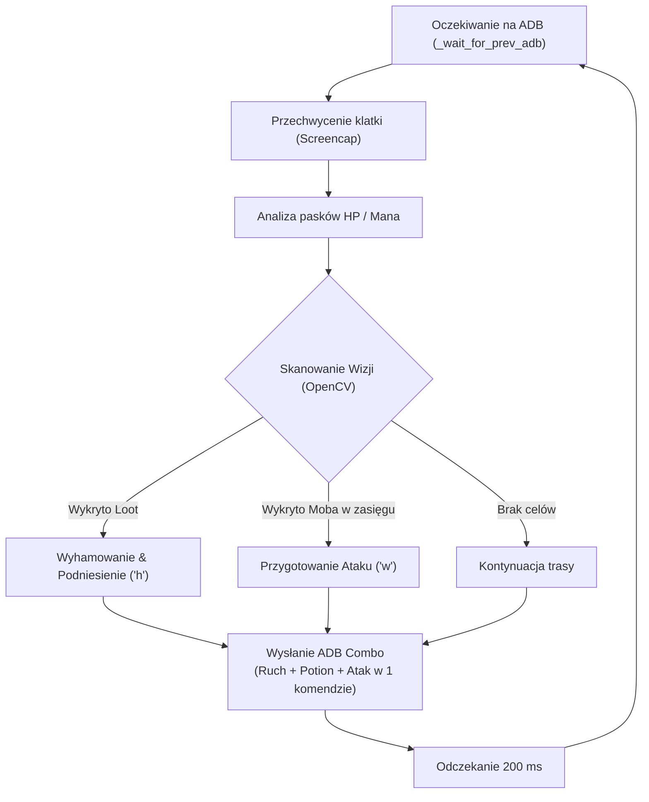

# Rucoy Online Standalone Archer Bot

> Zaawansowany, w pełni autonomiczny bot do gry MMORPG **Rucoy Online** działający w tle przez interfejs ADB na emulatorze Nox Player.

---

## O projekcie

Projekt to zoptymalizowany system automatyzacji rozgrywki dla gry mobilnej **Rucoy Online** (klasa Archer). Narzędzie przetwarza obraz gry w czasie rzeczywistym, samodzielnie porusza się po wyznaczonych trasach patrolowych (waypointach), namierza potwory (m.in. jaszczury na L4), zbiera upuszczony loot oraz automatycznie zarządza miksturami HP i Many. 

Dzięki bezpośredniej integracji z mostem **ADB (Android Debug Bridge)** emulatora Nox Player (rozdzielczość 1600x900), bot wysyła komendy dotykowe w tle — nie przejmuje kursora myszy ani nie wymaga, aby okno gry było aktywne na ekranie.

---

## Tech Stack


---

## Kluczowe Funkcjonalności i Optymalizacje

* **Sterowanie w Tle (ADB Background Mode):** Bezpośrednia komunikacja z emulatorem (`127.0.0.1:62001`). Okno gry może być zminimalizowane lub przykryte innymi aplikacjami.
* **Jednolicie Połączone Komendy ADB (Combo Sequence):** Wykonywanie Ruchu, Użycia Potiona oraz Ataku w jednej niepodzielnej instrukcji shella ADB (`input tap`). Eliminuje to konflikty multitoucha i rywalizację procesów.
* **Bariera Anty-Wyścigowa (`_wait_for_prev_adb`):** Zapobiega nakładaniu się klatek – bot czeka na potwierdzenie zakończenia poprzednich akcji ADB przed wykonaniem kolejnego zrzutu ekranu.
* **Pre-downscaling Wizji o 50% (`VISION_DOWNSCALE = 0.5`):** Przeskalowanie klatek i szablonów zapewnia 4-krotne przyspieszenie analizy wizualnej (<10 ms).
* **Płynne Trasowanie:** Stałe tempo marszu 200 ms na krok (`WAYPOINT_STEP_DELAY = 0.20`) gwarantuje stabilne poruszanie się po trasach bez zacięć.
* **Throttling Czasowy:** Inteligentne skanowanie mobów co 0.3 s oraz lootu co 0.4 s z buforowaniem wyników w pamięci RAM.

---

## Konfiguracja i Progi Operacyjne

Wszystkie domyślne parametry sterujące bota:

| Parametr | Wartość | Opis |
| :--- | :--- | :--- |
| **Docelowa gra** | Rucoy Online | Mobilne MMORPG 2D (przystosowane pod postać Łucznika) |
| **Środowisko** | Nox Player (1600x900) | Port ADB: `127.0.0.1:62001`, tytuł okna: `'Nox'` |
| `MATCH_THRESHOLD` | `0.62` (62%) | Próg czułości dopasowania wzorca (OpenCV) dla mobów |
| `ITEM_MATCH_THRESHOLD` | `0.63` (63%) | Próg czułości wykrywania lootu na ziemi |
| `HP_POTION_THRESHOLD` | `< 75%` | Automatyczne leczenie (Klawisz `3`) badane z kolumny pikseli X=400 |
| `MANA_POTION_THRESHOLD` | `< 30%` | Automatyczne odnawianie many (Klawisz `1`) |
| `POTION_COOLDOWN` | `1.0 s` | Odstęp czasowy przed kolejnym użyciem mikstury |
| `KEY_SPECIAL_ATTACK` | `w` | Klawisz ataku specjalnego łucznika |
| `KEY_LOOT` | `h` | Klawisz zbierania przedmiotów (ikona łapki w Nox) |

---

## Struktura Katalogów

```
rucoy/
├── rucoy_bot.py                 # Główny skrypt bota (FSM, Vision, Controller, CLI)
├── README.md                    # Dokumentacja projektu
├── CONTEXT.md                   # Dokument kontekstowy
├── routes/
│   └── l4_route.json            # Gotowa trasa patrolowa L4 (248 precyzyjnych waypointów)
└── templates/
    ├── lizard_variants/         # Szablony graficzne jaszczurów
    └── item_variants/           # Szablony graficzne upuszczonego lootu
```

---

## Instalacja

Wymagany Python 3.10+ oraz emulator Nox Player z włączonym debugowaniem ADB.

```bash
git clone [https://github.com/Anti0I/rucoy.git](https://github.com/Anti0I/rucoy.git)
cd rucoy

pip install -r requirements.txt
```

> **Ważne:** Ustaw rozdzielczość emulatora Nox Player na **1600x900** oraz upewnij się, że port ADB `62001` jest aktywny.

---

## Użycie i Narzędzia CLI

### 1. Uruchomienie bota na gotowej trasie (np. L4)
```bash
python rucoy_bot.py --route routes/l4_route.json
```

### 2. Nagrywanie własnej nowej trasy (Direct Nox Hook)
```bash
python rucoy_bot.py --record-route routes/nowa_trasa.json
```
*Kliknięcia rejestrowane są bezpośrednio z okna Nox. Aby zakończyć nagrywanie, naciśnij `ENTER` lub `q` w konsoli.*

### 3. Kalibracja i dodawanie nowych szablonów mobów
```bash
python rucoy_bot.py --calibrate-lizard
```

### 4. Kalibracja i dodawanie nowych szablonów lootu
```bash
python rucoy_bot.py --calibrate-item
```

---

## Przepływ Pętli Głównej (System Flow)


